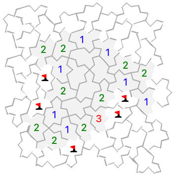

# What’s new

## 2026-09-17 {.date}

[Mines](../mines) has several new grid types: honeycomb, triangular, and some more
unusual tilings. There are even grids that wrap around the edges.
(Contributed to the original portable puzzle collection by Anders Höglund.)

{: width="178" height="178"}

When you're playing the new grids, remember that the surrounding mine counts include
*every* tile that touches *even just at a corner.* The new "Highlight adjacent flags
when clicking on a clue" preference can be helpful to get familiar with the new tilings.

## 2026-09-16 {.date}

New *Add all marks* and *Hint* options in the game menu work like the `M` and `H` keys,
for puzzles that offer those features.

[Rome](../rome) now supports *Add all marks* (`M` key) and *Add hint marks* (`H` key).
Hints fills in all pencil marks except ones that couldn't be possible (like arrows that
point off the edge of the board or directly at the opposite arrow).
